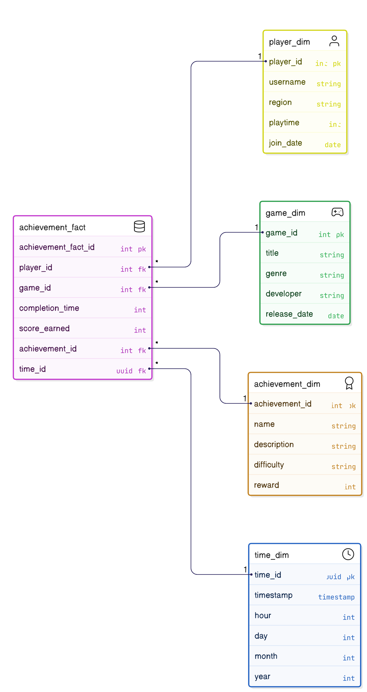

# 🎮 Gaming Achievement Analytics


A web application built with **Streamlit** and **PostgreSQL** to analyze gaming achievements. Users can enter SQL queries, visualize the results, and manage data.

---

## 📌 **Project Overview**
The **Gaming Achievement Analytics** project is a data-driven web application designed to help game developers, analysts, and enthusiasts explore and analyze gaming achievement data. The application allows users to interact with a PostgreSQL database, execute SQL queries, and visualize the results in real-time.

### **✨ Features**
✔ **Interactive Query Tool** – Enter SQL queries and view results as tables & charts.  
✔ **Data Generation** – Generate **fake gaming data** and store it as CSV files.  
✔ **Data Loading** – Load **CSV data into PostgreSQL** automatically.  
✔ **Predefined Analytics** – Run built-in queries for insights into **top players & hardest achievements**.  

---

## 📁 **Project Structure**
```
gaming_analytics/
│
├── Data/                      # Dataset folder
│   ├── players.csv            # Player details dataset
│   ├── games.csv              # Game details dataset
│   ├── achievements.csv       # Achievement details dataset
│   ├── time.csv               # Time-related data
│   ├── achievement_facts.csv  # Player achievement records
│    
├── src/                       # Local package
│   ├── __init__.py            # Package initialization
│   ├── analyzer.py            # Predefined queries and insights
│   ├── data_generator.py      # Generates synthetic data
│   ├── data_loader.py         # Loads data into PostgreSQL
│   ├── utils.py               # Database connection utility
│
├── app.py                     # Main Streamlit application
├── config.yml            # Environment setup with dependencies & variables
├── requirements.txt           # (Optional) List of dependencies for pip users
├── README.md                  # Project documentation
```

---

## 🛠 **Setup & Installation**
### **1️⃣ Install Conda Environment**
Instead of installing dependencies manually, use Conda to create an isolated environment.
```bash
conda env create -f config.yml
conda activate game_achievement_analytics
```
👉 This installs all required dependencies, sets up **environment variables**, and configures the dataset directory.

### **2️⃣ Configure Environment Variables**
Modify `config.yml` before installing the environment:
```yaml
variables:
  DATA_DIR: "Data"  # Where generated datasets are stored
  DB_HOST: "localhost"
  DB_NAME: "your-db-name"
  DB_USER: "your-username"
  DB_PASS: "your-password"
  PLAYERS_FILE: "players.csv"
  GAMES_FILE: "games.csv"
  ACHIEVEMENTS_FILE: "achievements.csv"
  TIME_FILE: "time.csv"
  ACHIEVEMENT_FACTS_FILE: "achievement_facts.csv"
```
📂 **Now, all scripts will automatically use these paths instead of hardcoded values.**

---

## 📊 **Datasets**
This project generates **synthetic datasets** related to gaming achievements.

### **Generated Datasets**
The project uses the following datasets, which are generated synthetically:

### 1. **Players (`player_dim`)**
   - Contains details about players.
   - **Columns**:
     - `player_id` (Primary Key): Unique identifier for each player.
     - `username`: Player's username.
     - `region`: Player's region or country.
     - `playtime`: Total hours played by the player.
     - `join_date`: Date the player joined the platform.

### 2. **Games (`game_dim`)**
   - Contains details about games.
   - **Columns**:
     - `game_id` (Primary Key): Unique identifier for each game.
     - `title`: Title of the game.
     - `genre`: Genre of the game (e.g., Action, RPG, Strategy).
     - `developer`: Developer of the game.
     - `release_date`: Release date of the game.

### 3. **Achievements (`achievement_dim`)**
   - Contains details about achievements.
   - **Columns**:
     - `achievement_id` (Primary Key): Unique identifier for each achievement.
     - `name`: Name of the achievement.
     - `description`: Description of the achievement.
     - `difficulty`: Difficulty level (e.g., Easy, Medium, Hard).
     - `reward`: Points or rewards for completing the achievement.

### 4. **Time (`time_dim`)**
   - Contains timestamps for achievement completions.
   - **Columns**:
     - `time_id` (Primary Key): Unique identifier for each timestamp.
     - `timestamp`: Timestamp of the achievement completion.
     - `hour`: Hour of the day.
     - `day`: Day of the month.
     - `month`: Month of the year.
     - `year`: Year.

### 5. **Achievement Facts (`achievement_fact`)**
   - Contains records of players completing achievements.
   - **Columns**:
     - `achievement_fact_id` (Primary Key): Unique identifier for each record.
     - `player_id` (Foreign Key): References `player_dim`.
     - `game_id` (Foreign Key): References `game_dim`.
     - `achievement_id` (Foreign Key): References `achievement_dim`.
     - `time_id` (Foreign Key): References `time_dim`.
     - `completion_time`: Time taken to complete the achievement (in seconds).
     - `score_earned`: Points earned for completing the achievement.

📂 **All datasets are stored in the `DATA_DIR` location, which can be customized.**

---

## 📊 **Database Schema (Star Schema)**
The database is designed using a **star schema**, a common data warehouse design pattern. The star schema consists of a central **fact table** surrounded by **dimension tables**. Here’s how the tables are structured:

<p align="center">
  
</p>


### Fact Table
- **`achievement_fact`**:
  - Contains records of players completing achievements.
  - **Columns**:
    - `achievement_fact_id` (Primary Key): Unique identifier for each record.
    - `player_id` (Foreign Key): References `player_dim`.
    - `game_id` (Foreign Key): References `game_dim`.
    - `achievement_id` (Foreign Key): References `achievement_dim`.
    - `time_id` (Foreign Key): References `time_dim`.
    - `completion_time`: Time taken to complete the achievement (in seconds).
    - `score_earned`: Points earned for completing the achievement.

### Dimension Tables
1. **`player_dim`**:
   - Contains details about players.
   - **Columns**:
     - `player_id` (Primary Key): Unique identifier for each player.
     - `username`: Player's username.
     - `region`: Player's region or country.
     - `playtime`: Total hours played by the player.
     - `join_date`: Date the player joined the platform.

2. **`game_dim`**:
   - Contains details about games.
   - **Columns**:
     - `game_id` (Primary Key): Unique identifier for each game.
     - `title`: Title of the game.
     - `genre`: Genre of the game (e.g., Action, RPG, Strategy).
     - `developer`: Developer of the game.
     - `release_date`: Release date of the game.

3. **`achievement_dim`**:
   - Contains details about achievements.
   - **Columns**:
     - `achievement_id` (Primary Key): Unique identifier for each achievement.
     - `name`: Name of the achievement.
     - `description`: Description of the achievement.
     - `difficulty`: Difficulty level (e.g., Easy, Medium, Hard).
     - `reward`: Points or rewards for completing the achievement.

4. **`time_dim`**:
   - Contains timestamps for achievement completions.
   - **Columns**:
     - `time_id` (Primary Key): Unique identifier for each timestamp.
     - `timestamp`: Timestamp of the achievement completion.
     - `hour`: Hour of the day.
     - `day`: Day of the month.
     - `month`: Month of the year.
     - `year`: Year.

### **Fact-Dimension Relationship**
The **fact table** references multiple **dimension tables** using foreign keys.  
This makes querying **faster and more efficient** for analytics.

---

## 🛠 **Predefined Analytics**
The **`analyzer.py`** file contains predefined analytics functions.

### **Available Reports**
| Report | Description |
|--------|------------|
| **Top Players** | Shows top 10 players with highest achievement scores. |
| **Hardest Achievements** | Lists achievements with the least completions. |

### **How to Use?**
1. Open the **Streamlit app**.
2. In the sidebar, click on:
   - 🎖 **Show Top Players**
   - 🔥 **Most Difficult Achievements**
3. View instant insights & charts!

---

## ▶ **Running the Streamlit App**
After activating the environment, run:
```bash
streamlit run app.py
```
Then, open **`http://localhost:8501`** in your browser.

---

## 🔍 **Example SQL Queries**
Want to write your own queries? Use the **SQL editor** inside the app.

### **Top Players by Score**
```sql
SELECT p.username, SUM(af.score_earned) AS total_score
FROM achievement_fact af
JOIN player_dim p ON af.player_id = p.player_id
GROUP BY p.username
ORDER BY total_score DESC
LIMIT 10;
```

### **Hardest Achievements (Least Completed)**
```sql
SELECT a.name, COUNT(*) AS completions
FROM achievement_fact af
JOIN achievement_dim a ON af.achievement_id = a.achievement_id
WHERE a.difficulty = 'Hard'
GROUP BY a.name
ORDER BY completions ASC;
```

---

## 🛠 **Generate & Load Data**
Use the sidebar buttons inside **Streamlit** to:
✅ **Generate fake data** using `data_generator.py`.  
✅ **Load data into PostgreSQL** using `data_loader.py`.  

Or manually run:
```bash
python -m src.data_generator
python -m src.data_loader
```

---

🚀 **Ready to analyze gaming achievements? Clone the repo and get started!**  
```bash
git clone https://github.com/amishkr22/Game-Acheivement-Analytics.git
cd Game-Acheivement-Analytics
```

---